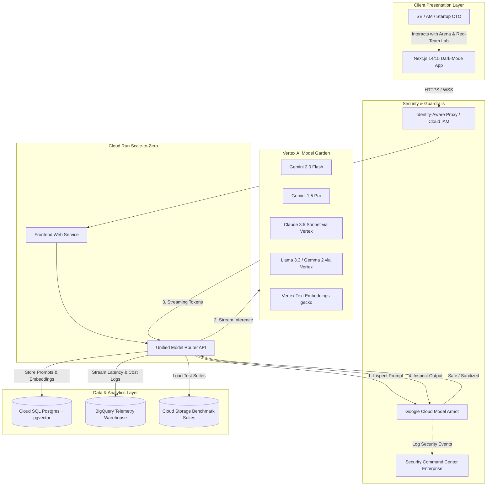

# Mode Arena ⚡️

> **Enterprise-Grade GenAI Evaluation, Model Armor Security & Multi-Model Benchmarking Platform**  
> *Built for Google Cloud Sales Engineers (CEs/SEs) & Account Managers (AMs) partnering with Series A/B Startups.*

[](https://cloud.google.com)
[](https://cloud.google.com/run)
[](https://cloud.google.com/vertex-ai)
[](https://cloud.google.com/security)
[](https://cloud.google.com/sql)
[](https://cloud.google.com/bigquery)
[-00C853)](#cost-optimization--budget-guardrails)

---

## 🎯 Strategic Purpose

Fast-moving Series A and Series B startups make architectural decisions at breakneck speed. When evaluating Google Cloud, founders and CTOs consistently ask three pivotal questions:

1. **Model Portability & Performance:** *"How does Gemini 2.0 Flash / 1.5 Pro compare to Claude 3.5 Sonnet and open-weight models (Llama 3.3) on latency (TTFT), throughput, and cost per million tokens?"*
2. **AI Security & Guardrails:** *"How do we prevent prompt injection, jailbreaks, and PII leakage without building complex custom safety filters from scratch?"*
3. **Data Modernization & Cost:** *"Can we keep our relational PostgreSQL database, use vector search (`pgvector`), and stream real-time telemetry into BigQuery without massive infrastructure bills?"*

**Mode Arena** is a live, cloud-native showcase answering these exact questions. It runs in an **Argolis** test environment, strictly adheres to a **<$600/month budget ceiling**, and serves as both an interactive customer pitch tool and a living technical blueprint.

---

## 🚀 Key Capabilities

- **⚡️ Multi-Model Streaming Arena:** Side-by-side prompt execution comparing Gemini 2.0 Flash, Gemini 1.5 Pro, Claude 3.5 Sonnet (Vertex AI MaaS), and Llama 3.3.
- **⏱ Real-Time Latency & Cost Waterfalls:** Visual breakdown of Time to First Token (TTFT), tokens/second throughput, end-to-end duration, and exact query cost calculated from published GCP pricing.
- **🛡 Interactive Red-Team & Model Armor Lab:** Live demonstration of Google Cloud **Model Armor** blocking direct prompt injection, DAN jailbreaks, system prompt extraction, and sensitive data leakage with toggleable comparison (`OFF` vs `ON`).
- **🔍 Semantic Prompt Clustering & RAG:** Cloud SQL PostgreSQL with `pgvector` indexing prompt embeddings and evaluating retrieval accuracy.
- **📊 BigQuery Telemetry & Audit Stream:** Streaming benchmark events into BigQuery for historical latency analysis and cost forecasting.
- **👔 SE & AM Client Presentation Mode:** One-click executive view hiding developer debug panels, highlighting business ROI, cost comparisons, and architecture diagrams.
- **📖 In-App Architecture & Docs Explorer:** Live interactive architecture diagrams rendered directly in the application.

---

## 🏛 Solution Architecture



---

## 💰 Cost Optimization & Budget Guardrails

Mode Arena is specifically architected to run well under **$600/month** (typically **$75 – $190/month** for active demo usage, and **~$8 – $15/month** when idle):

| Service | Strategy | Idle Cost | Active Pitch Cost |
| :--- | :--- | :--- | :--- |
| **Cloud Run** | Min instances: 0 (Scale-to-Zero), max: 5 | $0.00 | $5.00 – $15.00 |
| **Cloud SQL** | `db-f1-micro` / `db-g1-small` with pause script | $8.00 (paused off-hours) | $20.00 – $35.00 |
| **Vertex AI** | Pay-per-token API calls during demos | $0.00 | $50.00 – $120.00 |
| **Model Armor** | Pay-per-request prompt inspection | $0.00 | $5.00 – $15.00 |
| **BigQuery** | On-demand (< 1 TB query/mo free tier) | $0.00 | < $1.00 |
| **Cloud Storage** | Standard tier (< 10 GB datasets) | $0.00 | < $0.50 |
| **Budget Alert** | Programmatic alerts at $300, $480, $600 | $0.00 | $0.00 |

Use the included helper script to pause Cloud SQL outside demo hours:
```bash
./scripts/toggle-cloud-sql.sh pause
./scripts/toggle-cloud-sql.sh resume
```

---

## 📚 Living Documentation Suite

Comprehensive technical and sales documentation is maintained in the [`docs/`](./docs) directory:

- 🏛 **[Architecture Deep-Dive](docs/ARCHITECTURE.md):** Complete component architecture, network topologies, and security boundaries.
- 🗺 **[Product Roadmap](docs/ROADMAP.md):** Planned quarterly milestones and future GCP integrations.
- ⚡️ **[Features & Battlecards](docs/FEATURES.md):** Feature catalog, startup pitch talking points, and competitor comparisons.
- 🎤 **[SE & AM Demo Guide](docs/DEMO_GUIDE.md):** 5-minute elevator pitch script and 15-minute technical deep-dive walkthrough.
- 💵 **[Cost Optimization Guide](docs/COST_OPTIMIZATION.md):** Detailed breakdown of budget controls and resource sizing.
- 📜 **[Changelog](docs/CHANGELOG.md):** Version history and feature release notes.
- 🏷 **[Versioning Strategy](docs/VERSIONING.md):** Semantic versioning and branching guidelines.

---

## 🛠 Quick Start (Local Development)

### 1. Prerequisites
- Node.js 20+ & npm
- Google Cloud CLI (`gcloud`) with ADC configured (`gcloud auth application-default login`)
- GCP Project with Vertex AI enabled (e.g. Argolis sandbox)

### 2. Setup & Installation
```bash
# Clone and enter directory
cd /Users/frankien/Work

# Install dependencies
npm install

# Configure environment variables
cp .env.example .env.local

# Run local development server
npm run dev
```
Open [http://localhost:3000](http://localhost:3000) in your browser.

---

## ☁️ Deployment to Google Cloud

Deploy the entire platform to Cloud Run in your Argolis project:

```bash
# Make deployment scripts executable
chmod +x scripts/*.sh

# Run automated deployment
./scripts/deploy.sh --project-id YOUR_ARGOLIS_PROJECT_ID --region us-central1
```

To provision infrastructure using Terraform:
```bash
cd terraform
cp terraform.tfvars.example terraform.tfvars
terraform init
terraform apply
```

---

## 🤝 Contributing & Best Practices

- Adhere to [Semantic Versioning 2.0.0](docs/VERSIONING.md).
- Keep all architecture documents in sync when introducing new GCP services.
- Never commit credentials or service account keys (`.gitignore` enforced).
- Run `npm test` and `npm run lint` before committing code.
