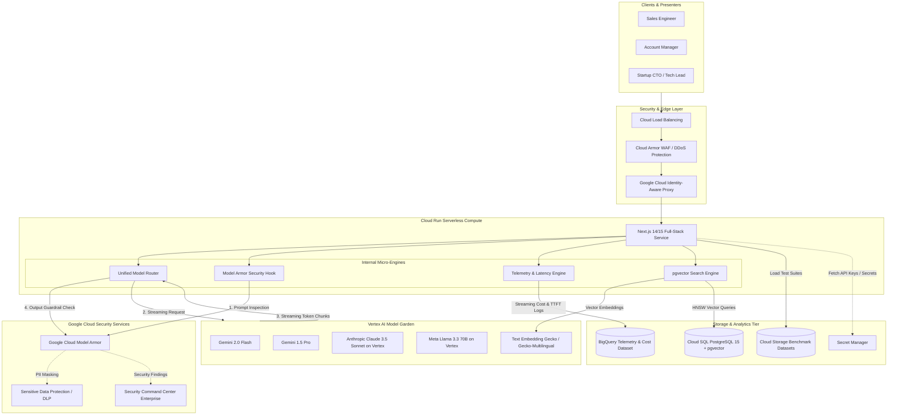
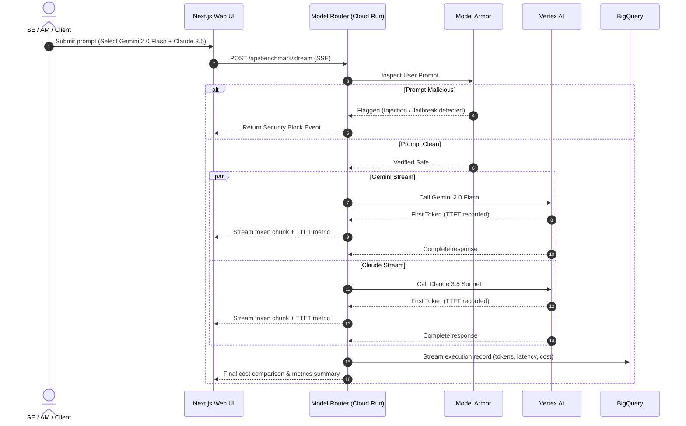

# Model Arena System Architecture 🏛

This document provides a comprehensive technical architecture of **Model Arena**, detailing the components, data flows, security posture, and Google Cloud Platform (GCP) services used throughout the platform.

---

## 1. High-Level Architecture

Model Arena implements a modern **Serverless Event-Driven Architecture** deployed on Google Cloud. It combines real-time streaming AI inference, automated prompt security inspection, relational vector search, and analytical telemetry.

---

## 2. Core Components & Responsibilities

### 2.1 Compute Tier: Cloud Run Serverless
- **Hosting:** Next.js full-stack container running on Cloud Run.
- **Scale-to-Zero:** Configured with `min_instances = 0` and `max_instances = 5` to ensure $0 idle compute cost while preventing runaway concurrent traffic.
- **Protocol:** HTTP/2 with Server-Sent Events (SSE) for sub-100ms streaming token delivery.
- **Service Account:** Dedicated least-privilege service account (`model-arena-sa@PROJECT.iam.gserviceaccount.com`).

### 2.2 Model Orchestration: Vertex AI Model Garden
Model Arena abstracts diverse AI models behind a unified interface:
- **Google Gemini 2.0 Flash & Gemini 1.5 Pro:** First-party frontier models with ultra-low latency, multimodal capabilities, and massive context windows (up to 2M tokens).
- **Anthropic Claude 3.5 Sonnet (Vertex Partner Model):** Served directly inside the GCP security perimeter via Vertex AI Models-as-a-Service (MaaS).
- **Meta Llama 3.3 70B & Gemma 2:** Open-weight models deployed via Vertex AI Model Garden endpoints.
- **Vertex Text Embeddings (`text-embedding-004`):** Generates 768-dimensional embeddings for prompt similarity and RAG document search.

### 2.3 Security Tier: Model Armor, DLP & SCCe
- **Model Armor:** Real-time inspection engine that evaluates prompts and model responses for:
  - Direct & indirect prompt injections
  - Jailbreaks (DAN, persona bypasses)
  - Malicious code & command injections
  - Hate speech, harassment, and unsafe content
- **Sensitive Data Protection (Cloud DLP):** Detects and masks credentials, API keys, Social Security Numbers, and credit card numbers before prompts leave the application.
- **Security Command Center Enterprise (SCCe):** All Model Armor violation events are forwarded to SCCe and Cloud Audit Logs for enterprise-wide threat visibility.

### 2.4 Data Tier: Cloud SQL, BigQuery & Cloud Storage
- **Cloud SQL PostgreSQL with `pgvector`:**
  - Database engine: PostgreSQL 15.
  - Instance sizing: `db-f1-micro` or `db-g1-small` with automated pause/resume scripts to cap monthly cost at ~$10–$25.
  - Extension: `pgvector` for storing 768-dim prompt embeddings and executing cosine similarity search (`<->` operator with HNSW index).
- **BigQuery (On-Demand):**
  - Dataset: `model_arena_telemetry`.
  - Tables: `benchmark_runs`, `model_latency_metrics`, `security_incidents`.
  - Partitioning: Partitioned by Day (`_PARTITIONDATE`) and clustered by `model_id`.
  - Cost: Free tier covers first 1 TB of queries per month.
- **Cloud Storage (GCS):**
  - Bucket: `gs://model-arena-datasets-${PROJECT_ID}`.
  - Stores static benchmark prompt suites (JSONL/CSV) and exportable customer presentation summaries.

---

## 3. Data Flow Sequences

### 3.1 Live Multi-Model Benchmark Flow

---

## 4. Network & Security Perimeter

- **Private Google Access:** Internal communication between Cloud Run, Cloud SQL, and Vertex AI utilizes Google's private backbone.
- **Cloud SQL Auth Proxy:** Cloud Run communicates with Cloud SQL over encrypted TLS using the Cloud SQL Go/Unix socket connector, avoiding public IP exposure.
- **IAM Least Privilege:**
  - `roles/aiplatform.user` (Invokes Vertex AI models)
  - `roles/cloudsql.client` (Connects to Cloud SQL)
  - `roles/bigquery.dataEditor` (Streams telemetry logs)
  - `roles/storage.objectViewer` (Reads benchmark datasets)
  - `roles/secretmanager.secretAccessor` (Reads runtime secrets)

---

## 5. Architectural Trade-Offs & Decisions

| Decision | Alternative Considered | Why Model Arena Chose This |
| :--- | :--- | :--- |
| **Cloud Run** | GKE Autopilot / Compute Engine | Cloud Run offers pure scale-to-zero ($0 idle cost), eliminating GKE's ~$74/mo management fee and unused node capacity. |
| **Cloud SQL (pgvector)** | Cloud Firestore / Pinecone | Startups overwhelmingly run PostgreSQL. Showing `pgvector` running directly inside Cloud SQL provides immediate technical relevance. |
| **Model Armor** | Custom regex / LangChain guardrails | Demonstrates native Google Cloud security capabilities and direct integration into enterprise SecOps (SCCe). |
| **BigQuery Streaming** | Cloud Logging only | BigQuery allows instant SQL-based analytics and Looker Studio dashboards for latency/cost tracking. |
