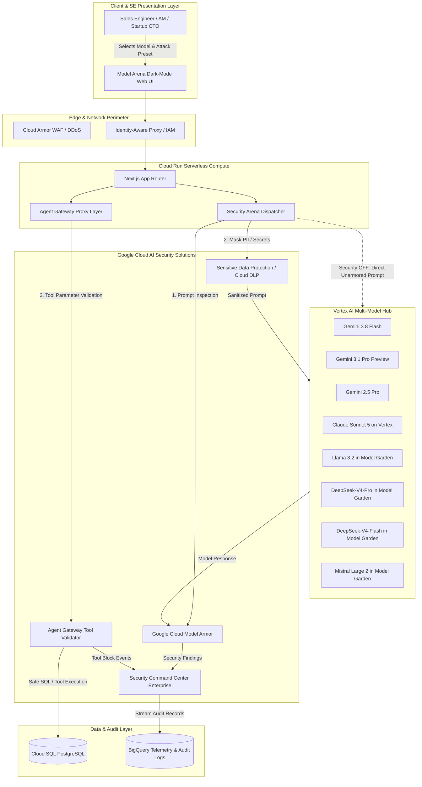

# Model Arena System Architecture: Google Cloud AI Security 🏛

This document details the technical architecture of **Model Arena**, Google Cloud's dedicated **AI Security, Guardrail & Model Armor Sandbox** built for Customer Engineers (CEs/SEs) and Account Managers (AMs) partnering with Series A/B startups.

---

## 1. High-Level Architecture

Model Arena demonstrates **Defense-in-Depth for Generative AI** across both Google-native frontier models and third-party partner models hosted on Vertex AI.

---

## 2. The 4 Core Google Cloud AI Security Solutions

### 2.1 Google Cloud Model Armor
- **What it solves:** Protects models from adversarial attacks before they reach LLM context windows.
- **Capabilities:**
  - **Prompt Injection Defense:** Blocks direct instruction overrides and system prompt extraction.
  - **Jailbreak Defense:** Neutralizes roleplay personas (e.g. DAN) designed to bypass ethical constraints.
  - **Indirect RAG Poisoning:** Inspects retrieved third-party documents for hidden injection links.
  - **Performance:** Sub-20ms inspection latency overhead.

### 2.2 Sensitive Data Protection (Cloud DLP)
- **What it solves:** Prevents customer PII (SSNs, credit card numbers, email addresses, passwords) from being ingested by models or logged into training pools.
- **Capabilities:**
  - Pre-execution regex & ML tokenization of 150+ predefined infoTypes.
  - Replaces real identifiers with synthetic tokens (e.g. `[REDACTED_SSN]`).

### 2.3 Google Cloud Agent Gateway
- **What it solves:** Protects backend databases and APIs from unauthorized tool calls generated by autonomous agents.
- **Capabilities:**
  - Enforces strict OpenAPI schema validation on tool parameters.
  - Blocks destructive SQL commands (`DROP TABLE`, `DELETE FROM`) and unauthorized API actions.
  - Enforces least-privilege IAM credentials.

### 2.4 Security Command Center Enterprise (SCCe)
- **What it solves:** Unifies AI security events into enterprise compliance workflows.
- **Capabilities:**
  - Automatic audit finding generation for every blocked attack.
  - SOC2, HIPAA, and PCI-DSS compliance readiness.

---

## 3. Supported Model Portfolio

Model Arena proves that Google Cloud's security solutions protect **any** model uniformly:
1. **Google Gemini 3.8 Flash:** Latest frontier intelligence with adjustable thinking levels and ultra-low latency.
2. **Google Gemini 3.1 Pro Preview:** Flagship multimodal high-reasoning intelligence with 2M token context.
3. **Google Gemini 2.5 Pro:** Production-hardened enterprise reasoning on Vertex AI.
4. **Anthropic Claude Sonnet 5:** Frontier agentic reasoning & intelligence via Vertex MaaS.
5. **Meta Llama 3.2:** Multimodal open-weights intelligence hosted on Vertex Model Garden.
6. **DeepSeek-V4-Pro:** Frontier open reasoning powerhouse on Vertex Model Garden.
7. **DeepSeek-V4-Flash:** High-throughput low-latency inference on Vertex Model Garden.
8. **Mistral Large 2 (2407):** Leading European frontier model on Vertex Model Garden.
