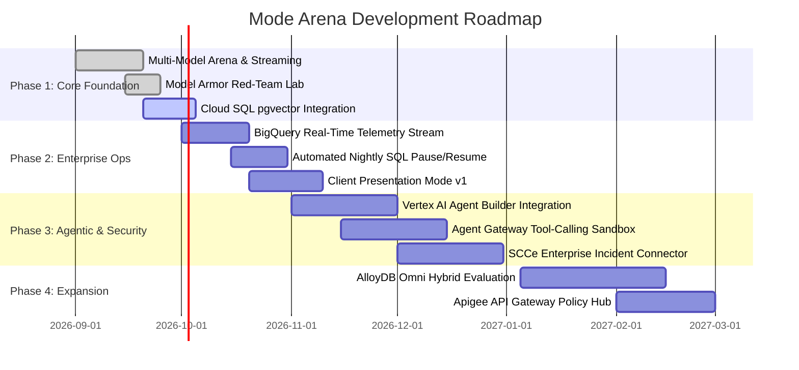

# Mode Arena Living Product Roadmap 🗺

This living roadmap outlines the evolution of **Mode Arena** from foundational MVP to an advanced multi-agent security testbed for Google Cloud Customer Engineers (CEs) and Account Managers (AMs).

---

## 🎯 Strategic Milestones Overview

---

## 📅 Detailed Milestone Breakdown

### Phase 1: Foundational MVP (Current Release - v1.0.0)
- [x] **Unified Multi-Model Router:** Native Vertex AI integration supporting Gemini 2.0 Flash, Gemini 1.5 Pro, Anthropic Claude 3.5 Sonnet, and Meta Llama 3.3.
- [x] **Sub-100ms SSE Streaming:** Real-time token streaming with visual latency waterfalls (Time to First Token, tokens/second).
- [x] **Live Cost Calculator:** Dynamic pricing engine calculating query cost in real-time based on official GCP token rates.
- [x] **Interactive Model Armor Red-Team Lab:** Side-by-side prompt injection, jailbreak, and PII masking playground with Model Armor toggled `ON` vs `OFF`.
- [x] **Living Documentation Suite:** In-repo documentation (`docs/`) synchronized with code.
- [x] **Terraform Infrastructure as Code:** Modular Terraform configuration for Cloud Run, Cloud SQL, BigQuery, and Cloud Storage.

---

### Phase 2: Enterprise Telemetry & Sales Enablement (v1.1.0 - Q4 2026)
- [ ] **BigQuery Streaming Ingestion:** Direct streaming insert of execution metrics (TTFT, total latency, input/output tokens, cost, security findings) into BigQuery table `mode_arena_telemetry.benchmark_runs`.
- [ ] **Embedded Looker Studio Dashboard:** Ready-made executive charts visualizing model cost comparisons and latency distributions over 30 days.
- [ ] **Automated Cloud SQL Sleep Schedule:** Cloud Scheduler + Cloud Run Job to automatically stop Cloud SQL at 8:00 PM and resume at 8:00 AM weekdays, cutting database cost by 65%.
- [ ] **Client Pitch Mode Polish:** Full-screen presentation mode that converts complex technical benchmark data into client-friendly slides with one click.
- [ ] **Benchmark Export:** Download pitch results as branded PDF executive summaries or CSV datasets.

---

### Phase 3: Agentic Workflows & Advanced Guardrails (v1.2.0 - Q1 2027)
- [ ] **Vertex AI Agent Builder Integration:** Multi-turn autonomous agent testbed running custom tools and OpenAPI specifications.
- [ ] **Agent Gateway Sandbox:** Secures agent tool calls with token rate-limiting, parameter validation, and prompt injection filtering between tool outputs and agent context.
- [ ] **Security Command Center Enterprise (SCCe) Event Bus:** Automatically streams high-severity Model Armor violations to SCCe finding queues.
- [ ] **Custom Red-Team Suite Importer:** Allow SEs to upload custom JSONL attack datasets tailored to specific client verticals (e.g. Healthcare HIPAA PII, Fintech PCI-DSS).

---

### Phase 4: Hybrid Cloud & Modernization (v1.3.0 - Q2 2027)
- [ ] **AlloyDB Omni Exploration:** Demonstrate running AlloyDB Omni locally or on multi-cloud Kubernetes alongside Cloud SQL.
- [ ] **Apigee API Gateway Layer:** Demonstrate enterprise API governance, token quotas, and developer portal integration for AI endpoints.
- [ ] **Automated LLM-as-a-Judge:** Automated evaluation scoring using Gemini 1.5 Pro judging accuracy, groundness, and instruction-following.

---

## 💡 Suggesting New Features

If you are a Sales Engineer or Account Manager using Mode Arena and need a specific GCP feature or model added:
1. Check [FEATURES.md](./FEATURES.md) to see if it's already supported or planned.
2. Review the cost impact in [COST_OPTIMIZATION.md](./COST_OPTIMIZATION.md).
3. Submit a feature request via Git issue or PR following [VERSIONING.md](./VERSIONING.md).
