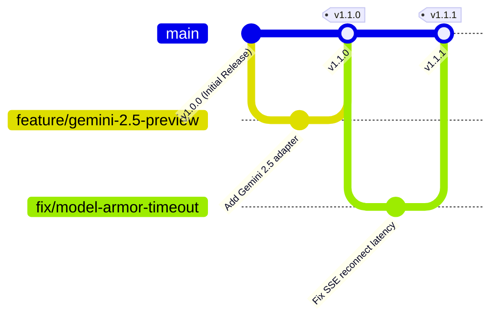

# Model Arena Versioning & Release Strategy 🏷

This project strictly adheres to **[Semantic Versioning 2.0.0](https://semver.org/)** (`MAJOR.MINOR.PATCH`).

---

## 1. Version Format

Versions are formatted as `vX.Y.Z`:

- **`MAJOR` (X):** Incremented when there are breaking architectural changes, incompatible API modifications, or major database schema migrations requiring manual intervention.
- **`MINOR` (Y):** Incremented when new GCP services, new AI models, or substantial features are added in a backwards-compatible manner (e.g. adding Vertex AI Agent Builder, introducing a new Model Armor filter).
- **`PATCH` (Z):** Incremented for backwards-compatible bug fixes, security patches, documentation updates, or minor UI adjustments.

---

## 2. Release Lifecycle



### Git Branching Strategy
- `main`: Production-ready branch. Always deployable to the Argolis Cloud Run instance.
- `feature/*`: Feature development branches (e.g. `feature/agent-gateway`, `feature/looker-studio-embed`).
- `fix/*`: Bug fixes and hotfixes.

### Release Tagging
Every production release to Cloud Run must be tagged in Git:
```bash
git tag -a v1.0.0 -m "Release v1.0.0: Initial Model Arena launch"
git push origin v1.0.0
```

---

## 3. Compatibility Matrix

| Model Arena Version | Next.js | Node.js | Google Cloud SDK | Terraform | Postgres (pgvector) |
| :--- | :--- | :--- | :--- | :--- | :--- |
| **v1.0.0** | 14 / 15 | >= 20.x | >= 490.x | >= 1.5.x | PostgreSQL 15 |
